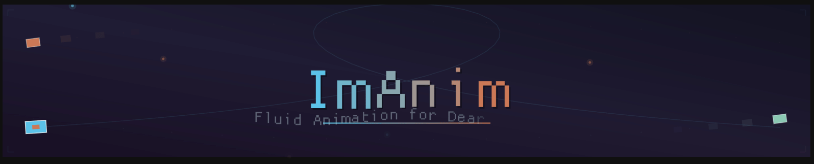
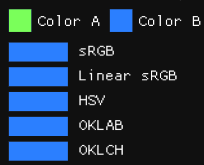
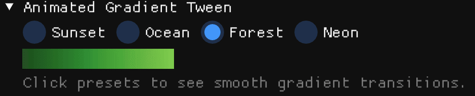
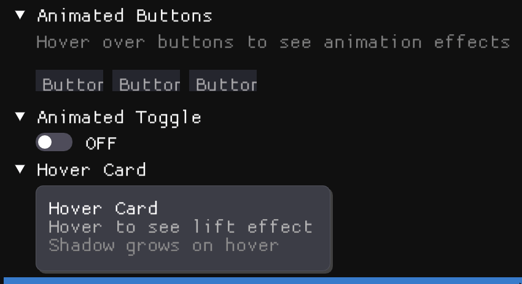

# ImAnim



**Animation Engine for [Dear ImGui](https://github.com/ocornut/imgui)**

ImAnim brings modern animation capabilities to ImGui applications. Write smooth, UI animations with minimal code.

```cpp
// Animate anything in one line
float alpha = iam_tween_float(id, channel, hovered ? 1.0f : 0.5f, 0.3f, ease, policy, dt);
```

## Why ImAnim?

- **Immediate-mode friendly** - Works naturally with ImGui's paradigm
- **Zero dependencies** - Only requires Dear ImGui
- **Large easing collection** - 30+ easing functions including spring physics
- **Perceptual color blending** - OKLAB and OKLCH
- **Responsive layouts** - Anchor-relative animations that survive window resizing

## Features at a Glance

| Category | Capabilities |
|----------|-------------|
| **Tweens** | Float, Vec2, Vec4, Int, Color with crossfade/cut/queue policies |
| **Clips** | Timeline keyframes, looping, callbacks, chaining, stagger |
| **Easing** | Quad to Bounce presets, cubic-bezier, steps, spring physics |
| **Paths** | Bezier curves, Catmull-Rom splines, text along paths |
| **Procedural** | Oscillators, shake, wiggle, Perlin/Simplex noise |
| **Extras** | Style interpolation, scroll animation, debug inspector |

## Quick Example

```cpp
#include "im_anim.h"

// Each frame
iam_update_begin_frame();
iam_clip_update(dt);

// Hover animation
bool hovered = ImGui::IsItemHovered();
float scale = iam_tween_float(
    ImGui::GetID("button"), ImHashStr("scale"),
    hovered ? 1.1f : 1.0f,
    0.15f,
    iam_ease_preset(iam_ease_out_back),
    iam_policy_crossfade,
    dt
);
```

## Installation

Add two files to your project:

```
src/im_anim.h
src/im_anim.cpp
```

That's it. No build system changes, no external dependencies.

## Documentation

Full documentation in the [`docs/`](docs/) folder:

- [Quick Start](docs/quickstart.md) - Get running in 5 minutes
- [Tweens](docs/tweens.md) - Immediate-mode animation
- [Clips](docs/clips.md) - Timeline-based keyframe animation
- [Easing](docs/easing.md) - All 30+ easing functions
- [Motion Paths](docs/motion-paths.md) - Animate along curves
- [Text Along Paths](docs/text-along-paths.md) - Curved text rendering
- [Stagger](docs/stagger.md) - Cascading element animations
- [Oscillators](docs/oscillators.md) - Continuous periodic motion
- [Shake & Wiggle](docs/shake-wiggle.md) - Feedback and organic motion
- [Noise](docs/noise.md) - Perlin/Simplex procedural animation
- [Text Stagger](docs/text-stagger.md) - Per-character text effects
- [Style Interpolation](docs/style-interpolation.md) - Animated theme transitions
- [Anchors](docs/anchors.md) - Resize-aware animation
- [Debug](docs/debug.md) - Inspector and debugging tools

## Demo

The `demo/` folder contains a comprehensive demo showcasing all features:

- Interactive easing curve visualizer
- Cubic bezier editor
- Spring physics playground
- All animation types with live controls
- Performance benchmarks

## Showcase

<table>
<tr>
<tr>
<td><br><strong>List Stagger</strong></td>
<td><br><strong>Grid Stagger</strong></td>
<td><br><strong>Card Animation</strong></td>
</tr>
<td><br><strong>Color Blending</strong></td>
<td><br><strong>Wave Color</strong></td>
<td><br><strong>Gradient</strong></td>
</tr>
</table>
<br><strong>ImGui Integration</strong>

## Contributing

Development is supported through Patreon:

[](https://www.patreon.com/SoufianeKHIAT)

## License

MIT License - see [LICENSE](LICENSE) for details.

---

*Made for the Dear ImGui community*
